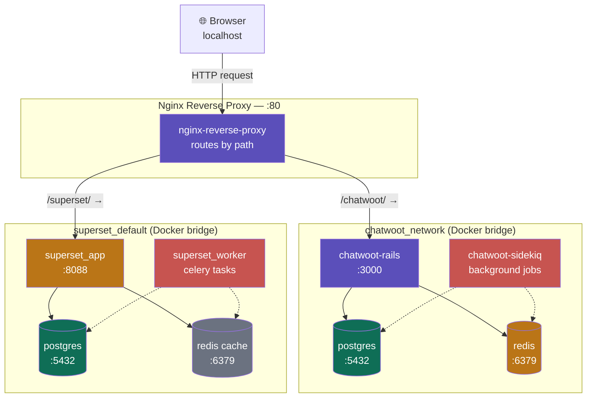

# Architecture Diagram

## Reverse Proxy Topology — Nginx in front of Chatwoot and Superset



## Request Flow

```
1. Browser sends GET http://localhost/chatwoot/
2. Nginx receives request on port 80
3. Nginx matches location /chatwoot/ in nginx.conf
4. Nginx forwards request to chatwoot-rails:3000 over chatwoot_network
   (resolved via Docker's embedded DNS at 127.0.0.11)
5. Rails processes request, queries Postgres / Redis as needed
6. Rails returns response to Nginx
7. Nginx forwards response back to Browser
```

## Network Isolation

Two separate Docker bridge networks exist by default:

| Network | Created by | Contains |
|---|---|---|
| `chatwoot_network` | Chatwoot's docker-compose | rails, sidekiq, postgres, redis |
| `superset_default` | Superset's docker-compose | app, worker, postgres, redis cache |

These networks are isolated from each other — a container on `superset_default` cannot resolve or reach a container on `chatwoot_network` by default.

**Nginx solves this by attaching to both networks simultaneously:**

```yaml
services:
  nginx:
    networks:
      - chatwoot_network
      - superset_network
```

This is what allows a single Nginx container to act as the bridge — reaching `chatwoot-rails` on one network and `superset_app` on the other, while the two backend networks remain otherwise isolated from each other.

## ASCII Fallback (if Mermaid doesn't render)

```
                         ┌──────────────┐
                         │   Browser    │
                         │  localhost   │
                         └──────┬───────┘
                                │ HTTP :80
                                ▼
                  ┌───────────────────────────┐
                  │   Nginx Reverse Proxy      │
                  │  routes by URL path        │
                  └─────────┬─────────┬────────┘
                /chatwoot/  │         │  /superset/
                            ▼         ▼
        ┌───────────────────────┐ ┌───────────────────────┐
        │  chatwoot_network     │ │  superset_default      │
        │  ┌─────────────────┐  │ │  ┌──────────────────┐ │
        │  │ chatwoot-rails   │  │ │  │ superset_app      │ │
        │  │     :3000        │  │ │  │     :8088         │ │
        │  └────────┬─────────┘  │ │  └─────────┬────────┘ │
        │           │            │ │            │          │
        │  ┌────────┴───┐ ┌────┐ │ │  ┌─────────┴──┐ ┌────┐│
        │  │  postgres   │ │redis│ │ │  postgres   │ │cache││
        │  └─────────────┘ └────┘ │ │  └────────────┘ └────┘│
        │  ┌──────────────────┐  │ │  ┌──────────────────┐ │
        │  │ chatwoot-sidekiq │  │ │  │ superset_worker   │ │
        │  └──────────────────┘  │ │  └──────────────────┘ │
        └───────────────────────┘ └───────────────────────┘
```
